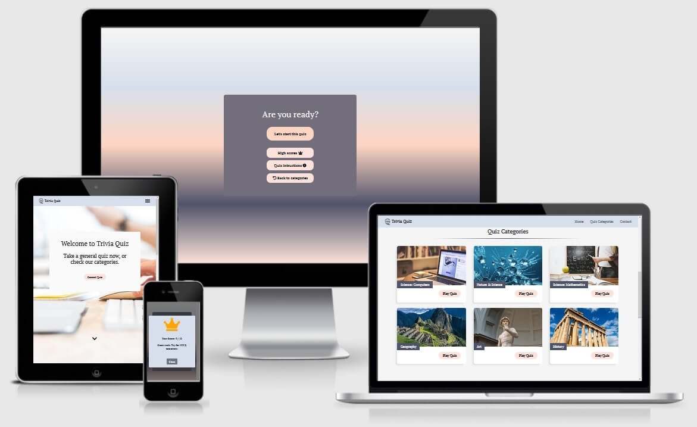
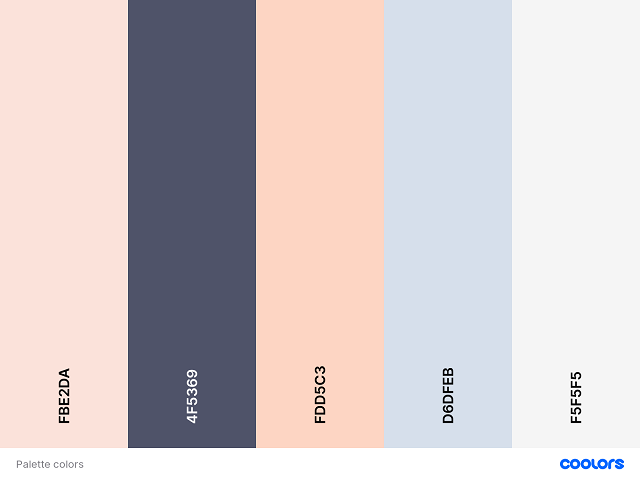
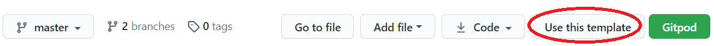
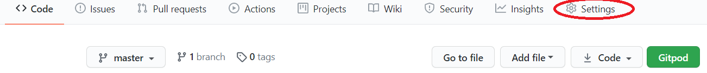

# Trivia Quiz



Trivia Quiz is a quiz app build to attract all categories of users by providing them with different categories and modern design. The reason behind having a modern design is simply because you can implement this app in any future website to attract more visitors and also for them to have some fun by enjoying a quiz.  

[View live project here](https://constantinadrian.github.io/Trivia_Quiz/)

## Table of Contents

1. [UX](#ux)

    - [User stories](#user-stories)

    - [Strategy](#strategy)

    - [Scope](#scope)

    - [Structure](#structure)

    - [Skeleton](#skeleton)

    - [Surface](#surface) 

2. [Technologies Used](#technologies-used)

3. [Testing](#testing)

4. [Deployment](#deployment)

    - [Inception project](#inception-project)

    - [GitHub Pages](#github-pages)

    - [Local Clone](#local-clone)

5. [Credit](#credit)

6. [Disclaimer](#disclaimer)

[Back to Top](#table-of-contents)

-----

- ### UX:

  - #### User stories

    I.	First Time Visitor Goals:

    - I would like to have the option to select a quiz from various categories.

    - If the quiz is finished, I would like to have the option to restart the quiz immediately without having to return to the main menu.

    - When I restart a quiz, I want to receive new questions for the category.

    - I want a quiz with different scores results, depending on how well I have done on the quiz.

    II.	Returning User Goals:

    - I want to find links to social media to find updates on the trivia-quizzes.

    - Be able to see my previous scores for each quiz that I take.

    III. Site Owner Goals:

    - Create a fun and friendly website where the users can enjoy having a quiz.

    - Let users have the option to select the quiz from various categories.

    - Let users be able to contact the site owner by email for any recommendation of different quizzes or improvements of any kind.


 - #### Strategy

    - The strategy for having a quiz website is to attract all categories of users and provide them with various categories of quizzes. Thru these quizzes, I want to offer the users an enjoyable and challenging experience each day.

[Back to Top](#table-of-contents)

-----
    
 - #### Scope

    - Provide a clean UX

    - Provide users with questions from different categories of quizzes.

    - Use an API to get the quiz categories with different questions each time.

[Back to Top](#table-of-contents)

-----
    
  - #### Structure

    - ##### Features: 

        Responsive on all screen devices.

      - ##### Existing Features:
    
        The website it's structure on three pages. 

        1. Home Page 

          - The logo of Trivia Quiz will take the user to the Home page.
          
          - Landing section - Where the user can take a general quiz or go to the Quiz Category section or Contact section from the navigation menu.

          - Quiz Category section - Where users can select a quiz from different categories. 

          - Contact section - Where users can contact the site owner by email for any recommendation of different quizzes or improvements of any kind. 

          - On the footer of the website, the users can find links to social media to follow for more updates on the Trivia Quiz app.

        2. Game Page 

          - At first, the user has a choice to start the quiz or to view the previous high score if any, view quiz instructions or go back to categories

          - When starting the quiz the questions are pull from Open Trivia DB API and displayed one by one with a countdown timer
        
          - The user can play the quiz that he started or if he changes his mind can reset the quiz or exit the quiz

          - When the quiz is finished, the user will see its score on a popup modal, and after he closes the modal he can play again the quiz or return to the home page to select a different category.

        3. 404 Page

          - 404 Page was added in case users redirect to a page that does not exist.

          Note: In order to make this page work the in the Slack community there was a pinned info about the 404 functionality. All I had to do was to create a 404.md file and place it with the 404.html in the root folder. 
 
      - ##### Future Features to Implement:

        - Provide users with a menu to select the number of questions and level of difficulty before starting the actual quiz 

        - Provide the user with a save menu when the quiz is complete, so that will allow them to use different names for each time they take a quiz if they want to have a more explicit history of a high score, instead of having just the higher score saved each time for the quiz that was played.  

[Back to Top](#table-of-contents)

-----

- #### Skeleton

    -  Phone Wireframes: [Home](assets/wireframes/index-phone.png) [Game](assets/wireframes/game-phone.png)

    -  Tablet Wireframes: [Home](assets/wireframes/index-tablet.png) [Game](assets/wireframes/game-tablet.png)

    -  Desktop Wireframes: [Home](assets/wireframes/index-desktop.png) [Game](assets/wireframes/game-desktop.png)

[Back to Top](#table-of-contents)

-----

- #### Surface

    -  ##### Colour Scheme

        - Palette:

             

            - The color was selected from palette colors and for this quiz app, I went with a palette of light and warm colors.

    -  ##### Typography

        - For the consistency of the quiz theme I chose one font-family PT Serif.

    -  ##### Imagery

        - Because imagery is important I have carefully chosen a light background hero image that will go with the quiz theme.

[Back to Top](#table-of-contents)

-----

- ### Technologies Used

  - #### Languages:

    - [HTML5](https://en.wikipedia.org/wiki/HTML5) - used to structure website and its content.

    - [CSS3](https://en.wikipedia.org/wiki/CSS) - to format the contents of each webpage.

    - [JS](https://en.wikipedia.org/wiki/JavaScript) - for DOM manipulation.

  - #### Frameworks, Libraries & Programs:

    - [Bootstrap](https://getbootstrap.com/) – CSS framework used to help with the navbar, contact form, and other classes that were used to make the quiz app responsive.

    - [Google Fonts](https://fonts.google.com/) - to import the font-family used in the website: PT Serif.

    - [Font Awesome](https://fontawesome.com/) - icons are a visual way to help add meaning to elements.

    - [GitHub](https://github.com/) - used to create and host the repository

    - [Git](https://git-scm.com/) - used for the version-control system for tracking changes in any set of files

    - [Gitpod](https://gitpod.io/) - IDE used to develop the project 

  - #### Additional tools:

    - [VS Code](https://code.visualstudio.com/) - IDE

    - [Autoprefixer CSS](https://autoprefixer.github.io/) - used to add prefix to css code

    - [Tinypng](https://tinypng.com/) - used to compress all image files in order to reduce loading time on each page

    - [HTML Validator](https://validator.w3.org/) - used to check HTML code for error

    - [CSS Validator](https://jigsaw.w3.org/css-validator/) - used to check CSS code for error

    - [JSHint](https://jshint.com/) - used to check JS code for error

    - [JSDoc](https://jsdoc.app/) - document the JavaScript code with JSDoc

    - [I Am Responsive](http://ami.responsivedesign.is/) - for the main image in Readme to show responsive to different screen size

    - [Balsamiq](https://balsamiq.com/) - used to make the wireframes for the project

    - [Coolors](https://coolors.co/) - used for color palette

    - [Adobe Photoshop 2020](https://www.adobe.com/ie/products/photoshop.html?gclid=Cj0KCQjwrsGCBhD1ARIsALILBYpcZ9gNDfvVo1tJUaPzX_D5Bbo7kr6tDseIjZmjRTGbiBTqIURjULAaAvGnEALw_wcB&mv=search&sdid=LZ32SYVR&ef_id=Cj0KCQjwrsGCBhD1ARIsALILBYpcZ9gNDfvVo1tJUaPzX_D5Bbo7kr6tDseIjZmjRTGbiBTqIURjULAaAvGnEALw_wcB:G:s&s_kwcid=AL!3085!3!441664403997!b!!g!!%2Bphotoshop!1423510553!55397634865) - for logo and favicon used on this project

[Back to Top](#table-of-contents)

-----

- ### Testing

    - Testing documentation can be found [HERE](TESTING.md)

 [Back to Top](#table-of-contents)

-----

- ### Deployment

  - #### Inception project 

    1. This project was created from the Code Institute project template from [here](https://github.com/Code-Institute-Org/gitpod-full-template) on Github by clicking on "Use this template"

        

    2. Once the project was created I rename it from the settings 

        

    3. When the repository was finally completed I open the project with [Gitpod](https://chrome.google.com/webstore/detail/gitpod-dev-environments-i/dodmmooeoklaejobgleioelladacbeki?hl=en) in Chrome browser

    4. In order to push this project from Gitpod on Github a set of commands were used:

        ```
        - git status  - Check the status of the repository and see if there were any changes in files 

        - git add .  - Add the files that were modified/created, so we can commit it 

        - git commit -m "message for commit"  - Commits all the changes

        - git push  - Pushes all committed versions to Github
        ```

  - #### GitHub Pages

    - The project was deployed to GitHub Pages using the following steps:

        1. Log in to GitHub and locate GitHub Repository

        2. At the top of the repository click on "Settings"

        3. Once you are in settings scroll down to "Github Pages" 

        4. Under "Source", click the dropdown called "None" and select "Master Branch".

        5. After the page automatically refresh scroll down again on "Github Pages" and you will see a live link to the published site.

  - #### Local Clone

    1. Log in to GitHub and locate GitHub Repository

    2. At the top of the repository click on Code 

    3. From the dropdown menu under HTTPS copy the link

    4. Now on your IDE create a directory where you wanna make the clone 

    5. Type git clone and paste the link that you copy from step 3. 

[Back to Top](#table-of-contents)

-----

- ### Credit

  - #### Code

    - Code for function sendMail was adapted from Full Stack Development Course - Interactive Frontend Development - Resume Project at [Code Institute](https://codeinstitute.net/)

    - [Bootstrap](https://getbootstrap.com/) - for navbar with some modification for collapse button, contact form, table for high scores, and other classes that I used for making the project responsive.

    - [Favicon](https://favicon.io/favicon-converter/) - for the code for use in this project; the favicon was created by the developer and saved in all sizes that were needed

    - [SweetAlert2](https://sweetalert2.github.io/#download) - for box alert that was used on the contact form as a response generated on user action when the form is submitted

    - [Stack Overflow](https://stackoverflow.com/questions/1191865/code-for-a-simple-javascript-countdown-timer) - function inspired and modified Countdown timer used for quiz

    - [MDN Web Docs](https://developer.mozilla.org/en-US/docs/Web/API/Web_Storage_API/Using_the_Web_Storage_API) - for the function to check local storage available

  - #### Content

    - https://www.tryinteract.com/blog/ as a general inspiration.

  - #### Media

    - All photos used on this project were taken from:

        - https://www.pexels.com/

        - https://pixabay.com/

  - #### Acknowledgements

    - [Code Institute](https://codeinstitute.net/) for all course material 

    - Slack community

    - My mentor Oluwafemi Medale for his support and feedback that he has given me for this milestone project.

[Back to Top](#table-of-contents)

-----

- ### Disclaimer

  - This project is for educational purposes only.
