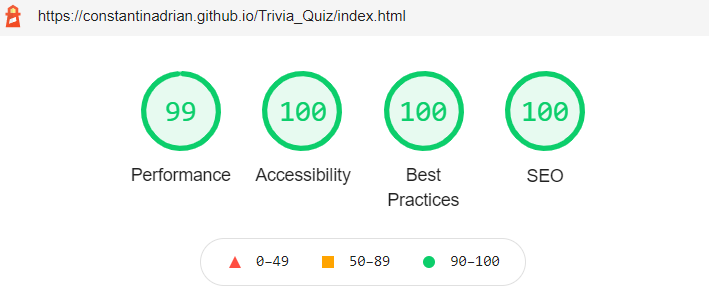

# Testing

## Table of Contents

1. [Code Validation](#code-validation)

    - [HTML](#html)

    - [CSS](#css)

    - [JS](#js)

2. [Lighthouse in Chrome DevTools](#lighthouse-in-chrome-devtools) 

3. [GTmetrix Website Performance Testing and Monitoring](#gtmetrix-website-performance-testing-and-monitoring)

4. [Browser compatibility and responsiveness](#browser-compatibility-and-responsiveness)

    - [Testing on Different Browsers](#testing-on-different-browsers)

    - [Testing on Different Devices](#testing-on-different-devices)

5. [Testing User Stories](#testing-user-stories)

6. [Manual testing](#manual-testing)

7. [Bugs and Fixs](#bugs-and-fixs)

-----

- ### Code Validation  

    - #### HTML 
    
        HTML checked was done with [The W3C Markup Validation Service](https://validator.w3.org/)
        
         - Home Page
         
            

         - Game Page 
         
             

    - #### CSS 
    
        CSS checked was done with [The W3C CSS Validation Service](https://jigsaw.w3.org/css-validator/)
    
        - CSS - style.css
        
            

            - All Warnings were from prefixes

        - CSS - game.css

            

            - All Warnings were from prefixes

    - #### JS 
    
        JS checked was done with [JSHint, a JavaScript Code Quality Tool](https://jshint.com/)

        - Emailjs

        

            - The three undefined variable are:

                EmailJS - is a service that allows us to send emails directly from your client-side JavaScript code.

                $ - jquery function.

                Swal - sweetalert2 library that acts as a replacement for the JavaScript’s alert() function.

            - Unused variable:

                sendMail - function that it's call with onsubmit attribute when the contact form is submitted

        - Game.js

        

            - All warning are from: 'let' is available in ES6 (use 'esversion: 6') or Mozilla JS extensions (use moz).

[Back to Top](#table-of-contents)

-----

- ### Lighthouse in Chrome DevTools 

    - Home page - desktop

        
        
    - Game page - desktop

        

    - Home page - mobile

        
        
    - Game page - mobile

        

[Back to Top](#table-of-contents)

-----

- ### GTmetrix Website Performance Testing and Monitoring

    - [GTMetrix](https://gtmetrix.com/) 
    
    - Home page
    
    -  
    
    - Game page  
    
    - 

[Back to Top](#table-of-contents)

-----

- ### Browser compatibility and responsiveness

  - #### Testing on Different Browsers

    - The following web browsers were used for testing the browser compatibility and responsiveness (System: Windows 10 64-bit).

        1. Chrome - Version 89.0.4389.90 (Official Build) (64-bit)

        2. Firefox - 87.0 (64-bit)

        3. Edge - Version 89.0.774.57 (Official build) (64-bit)

        4. Opera - Version:74.0.3911.232

        5. IE - Version 20H2

        All test was good. 

  - #### Testing on Different Devices

    1. iPhone 11 - IOS 14.0.1

    2. Ipad Mini 2 - IOS 12.4.8 

    3. Huawei P Smart

    4. iPhone 5S - IOS 10.2.1

    All test was good.

  - A large amount of testing was done to ensure that all pages were linked correctly.

[Back to Top](#table-of-contents)

-----

- ### Testing User Stories

    I. First Time Visitor Goals

    - I would like to have the option to select a quiz from various categories.

        - When the user enters the site he can immediately play a general quiz, or he can navigate to the Quiz category from the navigation bar or from the by pressing the down arrow from the landing page and select a quiz from various categories.

    - If the quiz is finished, I would like to have the option to restart the quiz immediately without having to return to the main menu.

        - When the quiz is finished the main quiz start menu will be shown to the user and the start quiz button will display "Play again".

    - When I restart a quiz, I want to receive new questions for the category. 

        - Every time a user starts a quiz game for the first time a call for a session token will be made to Trivia Quiz Database and store on sessionStorage, if available, thus every time the user wants to play again a certain category different questions will be displayed.

    - I want a quiz with different scores results, depending on how well I have done on the quiz.

        - After the user finishes the quiz, depending on how many questions he answered correctly a modal will be displayed with the score and a different message depending on the actual score.

    II.	Returning User Goals:

    - I want to find links to social media to find updates on the trivia-quizzes. 

        - On the footer of the page the user can find links to social media to find updates about the new categories of quizzes being added and keep in touch with Trivia Quiz.

    - Be able to see my previous scores for each quiz that I take.

        - Every time a user finishes a quiz the category and the quiz score will be store in local Storage, if available, and when returning the user can see his history. On local storage, we will store just the highest score for each category.

    III. Site Owner Goals:

    - Create a fun and friendly website where the users can enjoy having a quiz.

        - The design was chosen very carefully and with light warm colors that will attract the user and keep him longer on the site. To make it more friendly, different messages will be displayed when the user finishes the quiz along with the score. 

    - Let users have the option to select the quiz from various categories.

        - The site owner has carefully chosen a Quiz API that has several categories so that the user can benefit from a variety of categories.

    - Let users be able to contact the site owner by email for any recommendation of different quizzes or improvements of any kind.

        - On the index page the user can use the functional contact form to make any suggestions or to request any new quiz categories. 

[Back to Top](#table-of-contents)

-----

- ### Manual testing

    - Testing all links from the navigation bar on the index page

        - Expected: Once each link is pressed has to redirect to each section on the index page. Logo to reload the page.

        - Result: All links were working correctly.

    - Testing all links that redirect to play quiz.

        - Expected: Each link to open the game page with the query string of each category

        - Result: All links were working correctly.

    - Sending empty contact form.

        - Expected: If the user tries to send the empty form a required message is shown "Please fill out this field.".

        - Result: The message is working as expected 

    - Sending email with emailjs

        - Success 

            - Expected: If the user fills in the contact form and submits it an alert box with a success message shows.

            - Result: The message is displayed as expected.

        - Failed

            - Expected: If the user message could not send a failed message will be shown to the user.

            - Testing: After load the Trivia Quiz website and go to the contact section turn off the internet on PC and fill in the contact form and submit it. 

            - Result: The failed message is displayed as expected.

    - Check the social media links

        - Expected: That each link from social media opens in a new tab.

        - Result: All social media links open in a new tab as expected.

    - Check for failed communication with API call for token or quiz data
    
        - Expected: If communication to API call fails an error message is display to the user

        - Testing: Turn off the internet on PC and press "Let's start this quiz".

        - Result: An error message is shown to the user. All buttons and the link to the contact form from the error message box are working as expected.

        

    - If communication with API call for token or quiz data it's successful parse the data with JSON parse()
    
        - Expected: If data is not in the right format an error message it's shown to the user.

        - Testing: To catch the error thrown from JSON parse() the "try-catch" block was used. To check the future if the function that displays the error message works when an error it's thrown by JSON parse() a variable declared inside the try block.

            ```
            let quizToken = `
                    {
                        "status": "0",
                        "token": "U34jhi345u34yd",
                    }
                    `

            triviaQuizToken = JSON.parse(quizToken).token;

            ```

        - Result: An error message is shown to the user. All buttons and the link to the contact form from the error message box are working as expected.

         

    - If the token return all possible question for a specific category reset the token
    
        - Expected: Token to be reset in order to display questions for users.

        - Testing: The request query for a set a question was increase to 50 and multiple API calls was made in order to check if the token will be reset. Console.log was used to check when the token will be reset by displaying the token each time a call it's made.

        - Result: As expected when the token return all possible questions the reset token was done afterward.

    - Testing for display different score

        - Expected: That each time the user has a different score the message to be different

        - Result: At first the function didn't work properly due to a logical error but after fixing the logic everything works as expected.

         

         

    - Testing high score button

        - Expected: After the user press the high score button if he has any previous score to see it. If the user did not play any quiz before, a message will be displayed that he has no score. The return button from the high score menu returns the user to start the quiz menu.

        - Result: As expected the message "You don't have any score it!" is displayed and the return button returns to the quiz start menu.

        

    - No local storage available

        - Expected: If the user wants to see his previous score but local storage is not available and message inside the high score will be displayed that there is no storage available.

        - Testing: Type chrome://settings/content/cookies in the address bar in Chrome and select "Block all cookies". Go to the quiz menu and press high score.

        - Result: As expected is local storage is not available a message is displayed.
            
        

    - 404 page

        - Expected: if the user redirects to a page that does not exist a custom 404 page will display a message with a button to redirect to the home page.

        - Testing: Different page was trying to access from URL on the first test. On the second test the query string from the URL was change and the third the category was changed and refresh the page.

        - Result in all cases the user's redirecting to 404 page.

[Back to Top](#table-of-contents)

-----

- ### Bugs and Fixs

    - Internet Explorer: When press "Let's start this quiz" the quiz game wouldn't start.

        - In game.js, validateAnswer function was used "for (let of)" that was no support in Internet Explorer. 

        - To fix: the "for (let of)" loop was replaced with the "for" loop and the quiz game could start.

    - Internet Explorer: After the user selected an answer from the possible options, he couldn't see the background color of the selected answer of correct or wrong class because the hover background color was still visible.

        - To fix this in game.css was added another rule and the class of correct and wrong was added to selector with pseudo-class hover to have the background of the correct and wrong class wants its added

    - Internet Explorer: After adding the updateTimeLeft function the quiz game didn't start

        - In the updateTimeLeft function was use template literals that are not supported in IE.

        - To fix this concatenation was used instead.

    - Internet Explorer: After adding a check on the redirected link from index.html to game.html the quiz game wouldn't start
    
        - The includes() method was used to check selected category from the URL and if the query string is not changed as well. The includes() method is not supported in IE.

        - To fix this the includes() method was changed with indexOf().

    - An Uncaught TypeError: error was shown in console.log after implement of "error message function" 

        - The error was happing because in the case of failed to parse the data from API call with JSON.parse the "error" object was send to the implemented function and from there was access to the name of the error. But if the API status call was not 200 no object could be sent thus resulting in an error.

        - To fix this the "error . name" was sent from the function that was making the API call instead of the object.

    - Wrong message displayed at the finish of the quiz when the score was shown.

        - To fix this the logical AND operator (&&) was used. 

Return to [README.md](README.md)